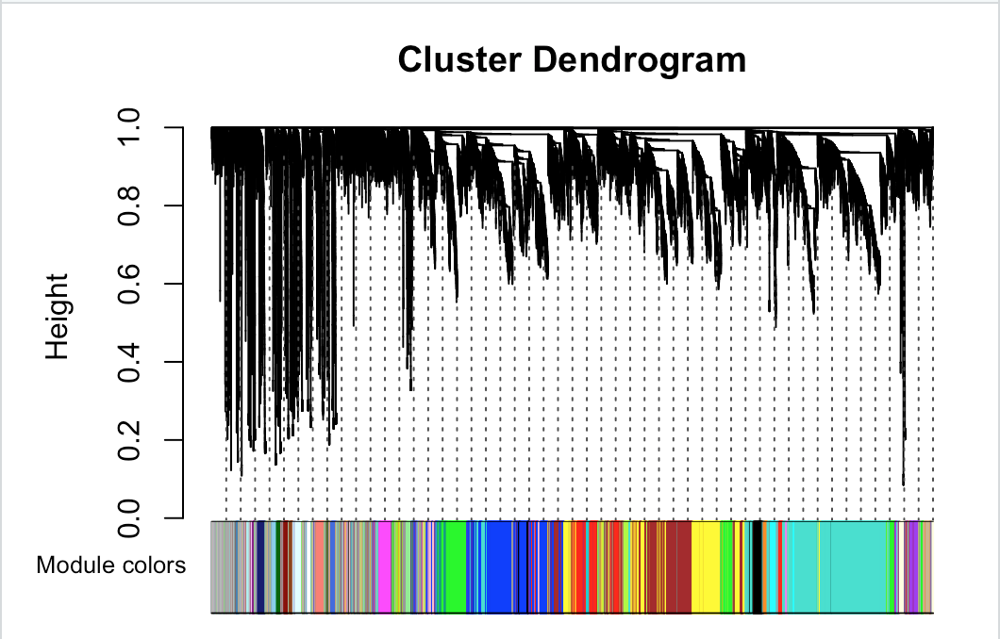
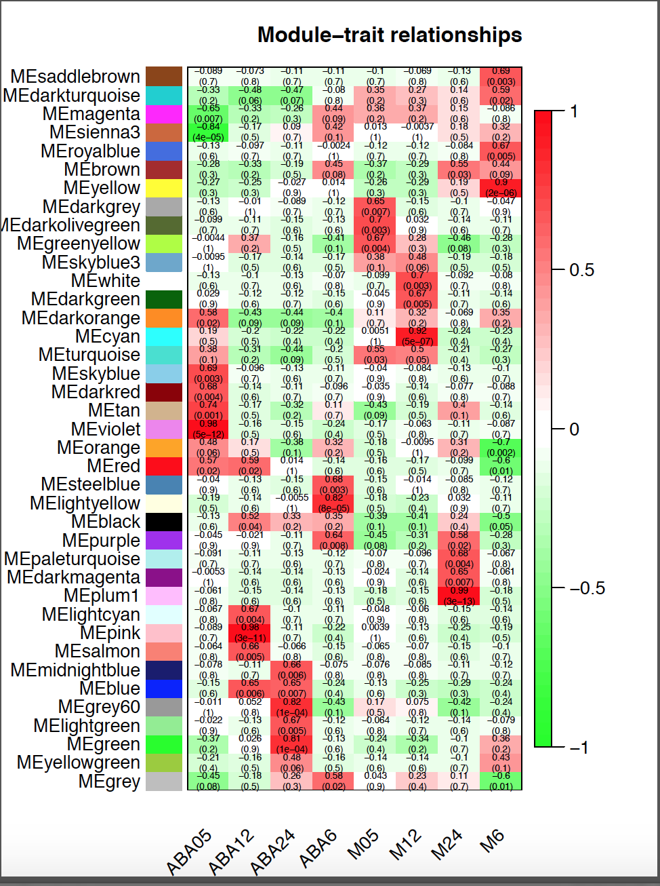
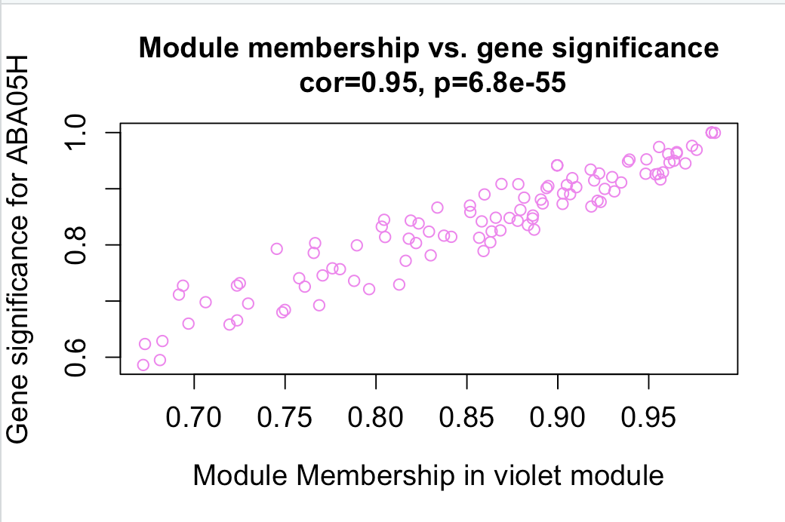
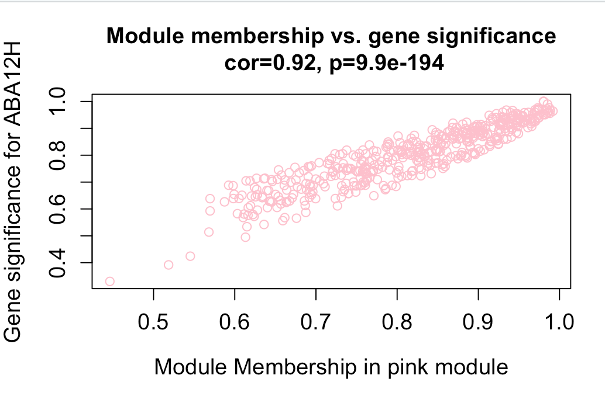
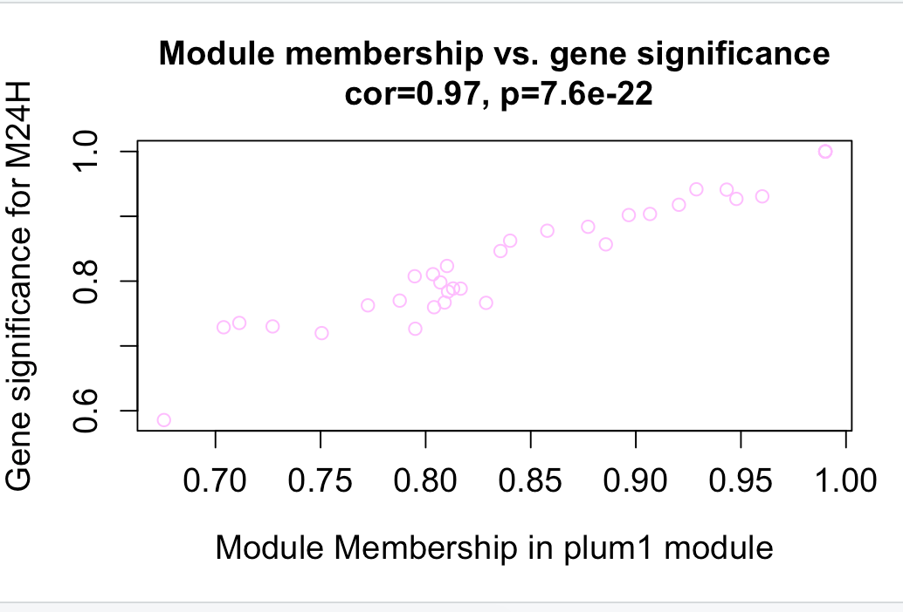

##  Abstract
Nowadays, most bioinformatics related researches based on prior biological knowledge when constructing an interdisciplinary network, which will limit the diversity of analysis and the fin-ding of new clues. So this research proposes to directly deal with sequencing data, technologic-ally based on constructing co-expression networks and gene enrichment methods, such as GO, KEGG, and so on. Meanwhile, database information are also used as references for data-driven  prediction analysis of biological process. In this research, two modules and 8 hubgenes are  found, which are highly related to Abidopsis thaliana`s reaction to ABA interference. Finally, b-ased on Enrichment analysis and annotation information, I revealed that Arabidopsis thaliana re-sisted the interference of ABA and produced phytoalexin in a short time, and then slowly rest-ore to a new homeostasis by improving glycometabolism-related activities.

####Keywords: Abscisic acid, Abidopsis thaliana, Weighted correlation network analysis

 
 
 
  
 
 

